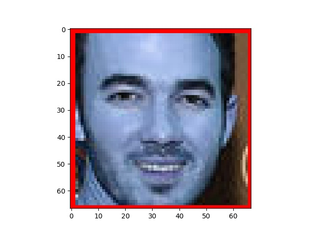
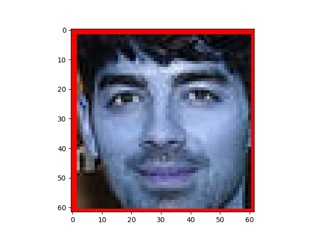
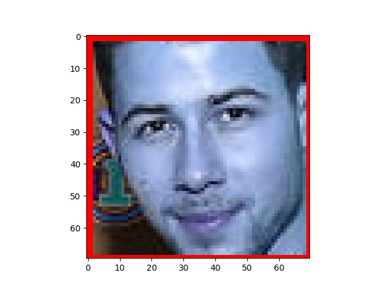

# Facial recognition using openCV
This repo contain python code to recognize face from an image using opencv and extract the faces

Just clone this repo and run the face.py using python 3.2 or above. Input the image file name when prompted .the <b>/faces</b> folder 
will contain extracted faces and <b>/images</b> folder will contain original image with face regions square boxed

Dependencies 

<ul>
<li>openCV</li>
 <li>matplotlib</li>
</ul>

#Square Boxed faces

#Extracted faces

